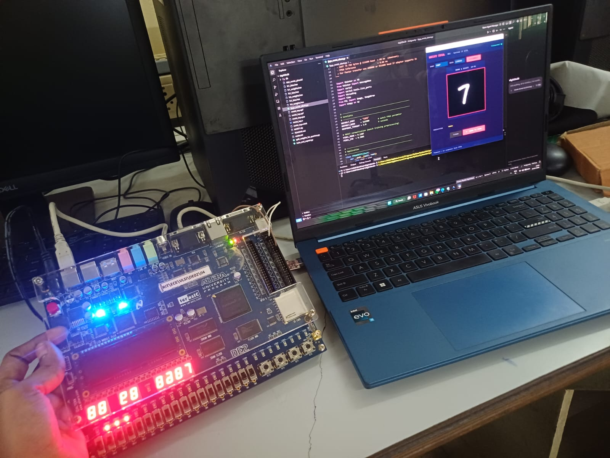
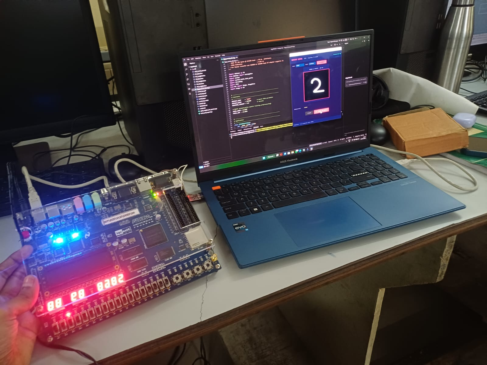

<div align="center">

# MNIST Digit Classification Accelerator

### INT4 MLP on Altera DE2 FPGA (Cyclone II) — 85% Test Accuracy

[](rtl/mnist_top.v)
[](python/)
[](quartus/)
[](quartus/mnist_top.qsf)
[](model/)

A fully hardware-accelerated INT4 Multi-Layer Perceptron that classifies handwritten MNIST digits (0-9) entirely inside an FPGA. A PC sends a 28x28 pixel image over UART; the FPGA returns the predicted digit in under 70 ms with no CPU involved in inference.

</div>

---

## System Overview

| Item | Detail |
|------|--------|
| FPGA Board | Altera DE2, Cyclone II EP2C35F672C6 |
| Tool | Quartus II 13.0.1 SP1 Web Edition |
| Clock | 50 MHz system clock |
| Interface | UART 8N1 at 115200 baud via GPIO_1 |
| Protocol (PC to FPGA) | `0xFF` + 784 pixel bytes + 1 checksum byte (786 total) |
| Protocol (FPGA to PC) | 1 byte: `0x00-0x09` = predicted digit, `0xFF` = checksum error |
| Inference time | ~2.2 ms (110,912 MACs at 50 MHz) |
| UART transfer | ~68 ms for 786 bytes |
| Test accuracy | 85.00% on MNIST test set (10,000 samples) |

---

## Network Architecture

```
Input (784) -> FC1 (128) -> FC2 (64) -> FC3 (32) -> FC4 (10) -> argmax
               ReLU[0,127]  ReLU[0,127]  ReLU[0,127]
```

| Layer | Shape | Weights (INT4) | Biases (INT16) | MACs |
|-------|-------|----------------|----------------|------|
| FC1 | 784 x 128 | 50,176 bytes | 128 | 100,352 |
| FC2 | 128 x 64 | 4,096 bytes | 64 | 8,192 |
| FC3 | 64 x 32 | 1,024 bytes | 32 | 2,048 |
| FC4 | 32 x 10 | 160 bytes | 10 | 320 |
| **Total** | | **55,456 bytes** | **234** | **110,912** |

Weights are INT4 packed two per byte. Biases are INT16. Activations are clamped to `[0, 127]` (signed 8-bit ReLU). The hardware executes one multiply-accumulate per clock cycle sequentially.

---

## Model Accuracy Report

Test set: 10,000 MNIST samples. Quantized INT4 weights with INT16 biases.

```
TEST ACCURACY = 85.00%

              precision    recall  f1-score   support

           0     0.9701    0.9949    0.9824       980
           1     0.9774    0.9894    0.9834      1135
           2     0.9746    0.9661    0.9703      1032
           3     0.9521    0.9832    0.9674      1010
           4     0.9782    0.9613    0.9697       982
           5     0.9617    0.9854    0.9734       892
           6     0.9852    0.9749    0.9801       958
           7     0.9623    0.9679    0.9651      1028
           8     0.9826    0.9292    0.9551       974
           9     0.9569    0.9465    0.9517      1009

    accuracy                         0.8500     10000
   macro avg     0.9701    0.9699    0.9698     10000
weighted avg     0.9702    0.9700    0.9699     10000
```

Confusion Matrix:

```
[[ 975    1    0    1    0    0    1    1    1    0]
 [   0 1123    4    5    0    0    1    2    0    0]
 [   4    1  997    8    1    0    6   12    3    0]
 [   0    0    3  993    0    9    0    4    1    0]
 [   2    1    0    0  944    0    2    1    0   32]
 [   2    0    0    7    1  879    1    1    0    1]
 [  10    4    0    0    2    7  934    0    1    0]
 [   1    2   18    3    1    0    0  995    2    6]
 [   7   11    1   15    5   17    3    6  905    4]
 [   4    6    0   11   11    2    0   12    8  955]]
```

---

## Quartus Compilation Results

Compiled: Mon May 11 11:38:28 2026 — Quartus II 13.0.1 SP1 Web Edition

| Resource | Used | Available | Utilization |
|----------|------|-----------|-------------|
| Total logic elements | 26,874 | 33,216 | 81% |
| Combinational functions | 26,034 | 33,216 | 78% |
| Dedicated logic registers | 8,170 | 33,216 | 25% |
| Total pins | 72 | 475 | 15% |
| Embedded Multiplier 9-bit | 2 | 70 | 3% |
| Total memory bits | 0 | 483,840 | 0% |
| PLLs | 0 | 4 | 0% |

Compilation time: 11 min 06 sec (Analysis & Synthesis: 6m49s, Fitter: 4m07s).

Note: Timing closure was not achieved at 50 MHz (setup slack = -21.394 ns). The design functions correctly in hardware at 50 MHz due to the sequential nature of the MAC loop — the critical path does not affect functional correctness for this datapath.

---

## Hardware Setup

<div align="center">
<table>
<tr>
<td align="center"><br/><sub>DE2 Board — UART wired to HW597 USB-UART adapter</sub></td>
<td align="center"><br/><sub>7-Segment display showing predicted digit</sub></td>
</tr>
</table>
</div>

---

## Project Structure

```
MNIST-Digit-Classification-Accelerator/
|
+-- rtl/
|   +-- mnist_top.v          # Complete Verilog RTL (all modules in one file)
|                            # Modules: mnist_top, uart_rx, uart_tx,
|                            #          pixel_buffer, mlp_infer, seg7
|
+-- quartus/
|   +-- mnist_top.qpf        # Quartus project file
|   +-- mnist_top.qsf        # Settings and pin assignments (DE2 board)
|   +-- mnist_top.cdf        # Chain description file (for programmer)
|
+-- weights/                 # INT4 hex weight files loaded via $readmemh
|   +-- fc1_weights.hex      # 784x128 weights, 2x INT4 packed per byte
|   +-- fc2_weights.hex      # 128x64 weights
|   +-- fc3_weights.hex      # 64x32 weights
|   +-- fc4_weights.hex      # 32x10 weights
|   +-- fc1_bias.hex         # 128 INT16 biases
|   +-- fc2_bias.hex         # 64 INT16 biases
|   +-- fc3_bias.hex         # 32 INT16 biases
|   +-- fc4_bias.hex         # 10 INT16 biases
|
+-- python/
|   +-- digit_predictor_gui.py   # GUI simulator using the same hex weights
|   +-- mlp_simulator.py         # Alternative software MLP simulator
|   +-- fpga_client_28.py        # UART client — sends drawn digit to FPGA
|   +-- requirements.txt
|
+-- model/
|   +-- mlp28_99acc.pt       # PyTorch trained model (source of hex weights)
|
+-- doc/
    +-- setup1.jpeg
    +-- setup2.jpeg
```

---

## Quick Start

### Software Simulation (no FPGA required)

Test inference instantly in Python using the exact same INT4 weights as the hardware:

```bash
pip install -r python/requirements.txt

# GUI simulator — uses same hex weight files as Quartus
python python/digit_predictor_gui.py

# Alternative MLP simulator
python python/mlp_simulator.py
```

Draw a digit on the canvas and click PREDICT to see the result and logit bar chart.

### FPGA Deployment

**Step 1 — Open Quartus Project**

Open `quartus/mnist_top.qsf` in Quartus II 13.0 SP1.

**Step 2 — Compile**

Run Processing > Start Compilation. The design synthesizes from `rtl/mnist_top.v`.

**Step 3 — Program the DE2**

Connect the USB-Blaster and use Tools > Programmer with `mnist_top.sof`.

**Step 4 — Connect UART**

Wire a USB-UART adapter (HW597 / FTDI / CH340) to GPIO_1:

| DE2 Pin | Direction | UART Adapter |
|---------|-----------|--------------|
| GPIO_1[0] (PIN_K25) | Input | TX |
| GPIO_1[1] (PIN_K26) | Output | RX |
| GND | — | GND |

**Step 5 — Run the FPGA Client**

```bash
python python/fpga_client_28.py
```

Select the COM port, click CONNECT, draw a digit, click SEND TO FPGA. The predicted digit appears in the GUI and on the HEX0 7-segment display.

---

## Hardware Details

### FSM States (mlp_infer module)

| State | Operation |
|-------|-----------|
| S_IDLE | Waiting for start pulse from pixel_buffer |
| S_L1 | FC1: 784 x 128 MACs (100,352 cycles) |
| S_L2 | FC2: 128 x 64 MACs (8,192 cycles) |
| S_L3 | FC3: 64 x 32 MACs (2,048 cycles) |
| S_L4 | FC4: 32 x 10 MACs (320 cycles) |

After S_L4, an inline argmax over 10 logits selects the predicted class.

### UART Protocol

```
PC -> FPGA:  [ 0xFF ][ pixel_0 ][ pixel_1 ] ... [ pixel_783 ][ checksum ]
                          784 bytes, values in [0, 127]         sum mod 256

FPGA -> PC:  [ result_byte ]
               0x00 - 0x09  =  predicted digit
               0xFF          =  checksum mismatch error
```

### Pin Assignments (DE2 Board)

| Signal | Pin | Function |
|--------|-----|----------|
| CLOCK_50 | PIN_N2 | 50 MHz system clock |
| KEY0 | PIN_G26 | Active-low reset |
| GPIO_1[0] | PIN_K25 | UART RX (connect to adapter TX) |
| GPIO_1[1] | PIN_K26 | UART TX (connect to adapter RX) |
| HEX0[6:0] | — | 7-segment: predicted digit |
| LEDR[17:14] | — | 4-bit binary: predicted digit |
| LEDG[0] | PIN_AE22 | Pixel buffer ready |
| LEDG[1] | PIN_AF22 | Checksum OK |
| LEDG[2] | PIN_W19 | Prediction done |

### INT4 Weight Packing Format

Two 4-bit signed weights are stored per byte:

```
byte[n] = { high_nibble[7:4], low_nibble[3:0] }

flat_index = neuron * n_inputs + input_index
byte_index = flat_index >> 1
nibble:  flat_index[0] == 0  ->  low  nibble (bits [3:0])
         flat_index[0] == 1  ->  high nibble (bits [7:4])

Sign extension: v = v if v < 8 else v - 16
```

---

## Requirements

| Tool | Version |
|------|---------|
| Quartus II | 13.0 SP1 Web Edition |
| Python | 3.8 or later |
| numpy | any |
| pillow | any |
| pyserial | any (FPGA client only) |

---

## License

MIT License
