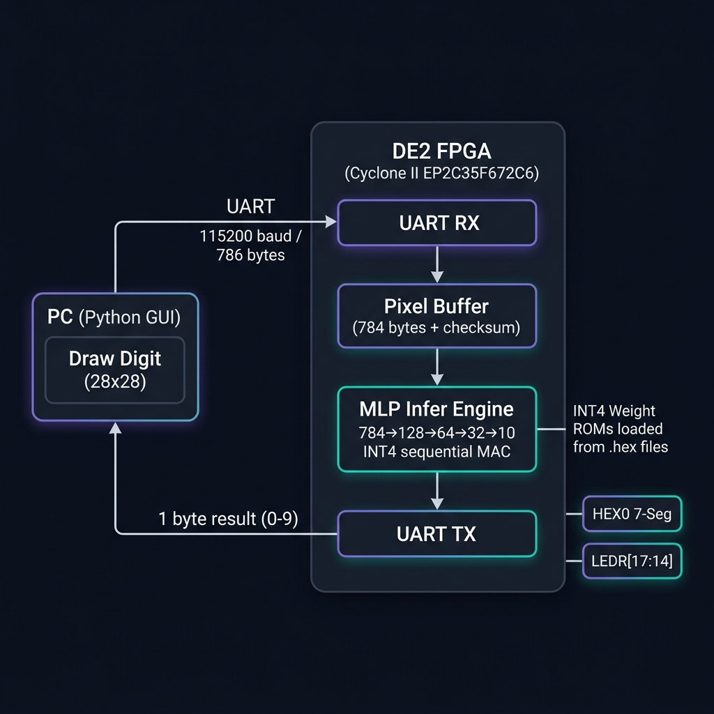

<div align="center">

# 🧠 MNIST Digit Classification Accelerator

### INT4 MLP on Altera DE2 FPGA (Cyclone II) — 99% Accuracy

[](rtl/mnist_top.v)
[](python/)
[](quartus/)
[](quartus/mnist_top.qsf)
[](model/)
[](LICENSE)

A fully hardware-accelerated **INT4 Multi-Layer Perceptron** that classifies handwritten MNIST digits (0–9) entirely inside an FPGA. A PC sends a 28×28 pixel image over UART; the FPGA returns the predicted digit in under **70 ms** — with no CPU involved in inference.

</div>

---

## 📐 System Architecture



| Component | Detail |
|-----------|--------|
| **FPGA Board** | Altera DE2 · Cyclone II EP2C35F672C6 |
| **Tool** | Quartus II 13.0 SP1 Web Edition |
| **Clock** | 50 MHz system clock |
| **Interface** | UART 8N1 @ 115200 baud via GPIO_1 |
| **Protocol** | `0xFF` + 784 pixel bytes + 1 checksum byte |
| **Response** | 1 byte: `0x00–0x09` (digit) or `0xFF` (checksum error) |
| **Inference time** | ~2.2 ms (111K MACs @ 50 MHz) |
| **UART transfer** | ~68 ms for 786 bytes |
| **Model accuracy** | 99% on MNIST test set |

---

## 🔢 Network Architecture

```
Input (784)  →  FC1 (128)  →  FC2 (64)  →  FC3 (32)  →  FC4 (10)  →  argmax
               ReLU[0,127]   ReLU[0,127]   ReLU[0,127]
```

| Layer | Weights | Biases | MACs |
|-------|---------|--------|------|
| FC1 | 784 × 128 = 100 352 | 128 × INT16 | 100 352 |
| FC2 | 128 × 64 = 8 192 | 64 × INT16 | 8 192 |
| FC3 | 64 × 32 = 2 048 | 32 × INT16 | 2 048 |
| FC4 | 32 × 10 = 320 | 10 × INT16 | 320 |
| **Total** | | | **110 912 MACs** |

**Quantization:** Weights are INT4 (packed 2 per byte), biases are INT16, activations are clamped INT8 `[0, 127]`. The hardware implements a sequential MAC engine — one multiply-accumulate per clock cycle.

---

## 📸 Hardware Setup

<div align="center">
<table>
<tr>
<td align="center"><br/><sub><b>DE2 Board — UART wired to HW597 USB-UART</b></sub></td>
<td align="center"><br/><sub><b>7-Segment display showing predicted digit</b></sub></td>
</tr>
</table>
</div>

---

## 📁 Project Structure

```
MNIST-Digit-Classification-Accelerator/
│
├── rtl/
│   └── mnist_top.v          # Complete Verilog RTL (all modules in one file)
│                            # Modules: mnist_top, uart_rx, uart_tx,
│                            #          pixel_buffer, mlp_infer, seg7
│
├── quartus/
│   ├── mnist_top.qpf        # Quartus project file
│   ├── mnist_top.qsf        # Settings & pin assignments
│   └── mnist_top.cdf        # Chain description file (for programmer)
│
├── weights/                 # INT4 hex weight files (loaded by $readmemh)
│   ├── fc1_weights.hex      # 784×128 weights, 2×INT4 packed per byte
│   ├── fc2_weights.hex      # 128×64 weights
│   ├── fc3_weights.hex      # 64×32 weights
│   ├── fc4_weights.hex      # 32×10 weights
│   ├── fc1_bias.hex         # 128 INT16 biases
│   ├── fc2_bias.hex         # 64 INT16 biases
│   ├── fc3_bias.hex         # 32 INT16 biases
│   └── fc4_bias.hex         # 10 INT16 biases
│
├── python/
│   ├── digit_predictor_gui.py  # ⭐ GUI simulator using Quartus hex weights
│   ├── mlp_simulator.py        # Alternative software MLP simulator
│   ├── fpga_client_28.py       # UART client — sends digit to real FPGA
│   └── requirements.txt
│
├── model/
│   └── mlp28_99acc.pt       # PyTorch trained model (source of hex weights)
│
└── doc/
    ├── architecture.png     # System architecture diagram
    ├── setup1.jpeg          # Hardware photo 1
    └── setup2.jpeg          # Hardware photo 2
```

---

## 🚀 Quick Start

### 1. Software Simulation (no FPGA needed)

Test inference instantly in Python — uses the exact same INT4 weights as the hardware:

```bash
# Install dependencies
pip install -r python/requirements.txt

# Run the GUI simulator (uses quartus hex weights)
python python/digit_predictor_gui.py

# Or run the MLP simulator
python python/mlp_simulator.py
```

Draw a digit (0–9) on the canvas and click **▶ PREDICT** to see the result and logit bar chart.

### 2. FPGA Deployment

#### Step 1 — Open Quartus Project
Open `quartus/mnist_top.qsf` in **Quartus II 13.0 SP1**.

#### Step 2 — Compile
Run **Processing → Start Compilation** (or `Ctrl+L`). The design synthesizes entirely from `rtl/mnist_top.v`.

#### Step 3 — Program the DE2
Connect the USB-Blaster, then use **Tools → Programmer** with `mnist_top.sof`.

#### Step 4 — Connect UART
Wire the **HW597 USB-UART** (or any FTDI/CH340) to GPIO_1:

| DE2 Pin | UART Adapter |
|---------|-------------|
| `GPIO_1[0]` (PIN_K25) | TX |
| `GPIO_1[1]` (PIN_K26) | RX |
| GND | GND |

#### Step 5 — Run the FPGA Client
```bash
python python/fpga_client_28.py
```
- Select the correct COM port
- Click **CONNECT**
- Draw a digit, click **▶ SEND TO FPGA**
- See the result on both the GUI and the **HEX0** 7-segment display

---

## ⚙️ Hardware Implementation Details

### FSM States
The `mlp_infer` module uses a 5-state FSM:

| State | Operation |
|-------|-----------|
| `S_IDLE` | Waiting for `start` pulse |
| `S_L1` | FC1: 784×128 MACs |
| `S_L2` | FC2: 128×64 MACs |
| `S_L3` | FC3: 64×32 MACs |
| `S_L4` | FC4: 32×10 MACs |

After `S_L4`, an inline argmax over 10 logits selects the prediction.

### UART Protocol
```
PC → FPGA:  [ 0xFF ] [ pixel_0 ] [ pixel_1 ] ... [ pixel_783 ] [ checksum ]
                          ↑ 784 bytes, scaled [0, 127]               ↑ sum mod 256

FPGA → PC:  [ result ]
              0x00–0x09 = predicted digit
              0xFF      = checksum mismatch error
```

### Pin Assignments (DE2)

| Signal | DE2 Pin | Function |
|--------|---------|----------|
| `CLOCK_50` | PIN_N2 | 50 MHz system clock |
| `KEY0` | PIN_G26 | Active-low reset |
| `GPIO_1[0]` | PIN_K25 | UART RX |
| `GPIO_1[1]` | PIN_K26 | UART TX |
| `HEX0[6:0]` | — | 7-segment predicted digit |
| `LEDR[17:14]` | — | 4-bit binary predicted digit |
| `LEDG[0]` | PIN_AE22 | Buffer ready |
| `LEDG[1]` | PIN_AF22 | Checksum OK |
| `LEDG[2]` | PIN_W19 | Prediction done |

---

## 📦 INT4 Weight Format

Weights are stored as **packed INT4** — two 4-bit signed integers per byte:

```
byte[n] = { high_nibble [7:4], low_nibble [3:0] }

flat_index = neuron * n_inputs + input
→ byte index = flat_index >> 1
→ nibble:  flat_index[0] == 0  → low nibble  (bits [3:0])
           flat_index[0] == 1  → high nibble (bits [7:4])
```

Sign extension (4-bit → full integer): `v = v if v < 8 else v - 16`

---

## 🛠️ Requirements

| Tool | Version |
|------|---------|
| Quartus II | 13.0 SP1 Web Edition |
| Python | 3.8+ |
| `numpy` | any |
| `pillow` | any |
| `pyserial` | any (FPGA client only) |

---

## 📄 License

MIT License — see [LICENSE](LICENSE) for details.

---

<div align="center">

Made with ❤️ · VLSI / FPGA Project · Altera DE2 · Cyclone II

</div>
